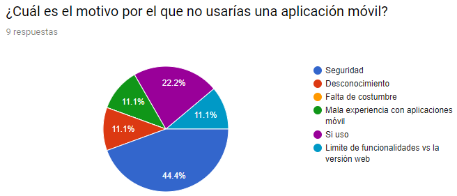
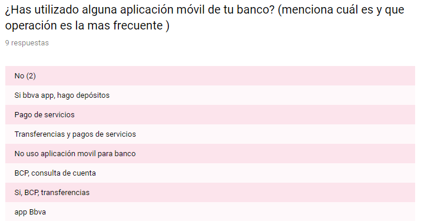
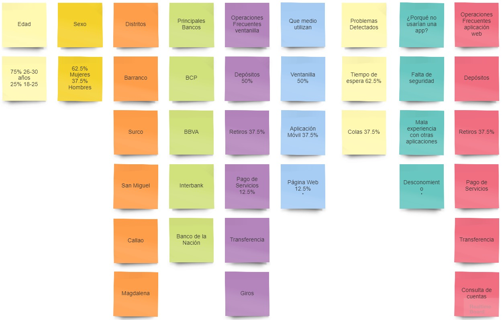

# Banco del País - Un banco 100% digital

El banco actualmente se encuentra por un proceso de transformación digital. Como parte de este proceso, han implementado el área de innovación para liderar la migración de las principales transacciones financieras.

## Objetivo

Enfocados en los millennials (research que se hizo en el reto anterior [Más información](https://drive.google.com/drive/u/0/folders/1LhpwvYvWbBKHB5H4FrhHwIl3lJ4R8IYY)) proponemos una plataforma enfocada en la omnicanalidad. Que nuestros usuarios tengan total libertad al realizar sus transacciones con la misma seguridad que tienen al acercarse a ventanilla.

## Proceso

**Encuestas on-line**

En el proceso de encuestas detectamos que la gran problemática venía en la _inseguridad_ y el
_desconocimiento_ por parte de los usuarios.

Por otro lado también pudimos identificar cuáles eran las principales transacciones que los millennials hacían en la web y/o app del banco.

**Entrevistas**

Entrevista realizada  a 3 personas que laboran en  diferentes bancos del Perú.

BCP 

. ¿Cuáles son las quejas más recurrentes en la agencia?

Quejas: cobros indebidos, errores.en operaciones, extornos.por pagos dobles

. ¿Que transacciones crees que podrían migrarse a una aplicación móvil y dejar de atenderse en ventanilla?

Migraciones : pagos de servicios (impuestos, y servicios varios) , operaciones de tipo de cambio

En qué crees que podrían mejorar los servicios o la atención que  brinda el banco? 

Podría mejorar.en procesos, simplificando procesos, mejoras los tiempos de respuesta de diversos trámites

La aplicación móvil que tiene el banco es óptima, explicanos (si/no)¿porqué?

La aplicación del banco si es óptima, ya que todos los pagos son en línea y rápidos salvo algunos pagos que tienen restricción de hora, estos son fijados por la.empresa recaudadora

La edad promedio que usa la aplicación móvil:

No estoy seguro, pero  por lo general lo usan personas de nuestra edad, aunque se podría  instruir a personas de más edad  usen Yape 

BANCO DE LA NACION

. ¿Cuáles son las quejas más recurrentes en la agencia?

Quejas hay muchas, pero las que saltan a simple vista así no seas cliente asiduo  al banco, son  las colas es con algo que se sigue peleando  día a día, hemos agilizado los trámites en ventanilla  pero aún así no  disminuimos el tiempo de espera.

. ¿Que transacciones crees que podrían migrarse a una aplicación móvil y dejar de atenderse en ventanilla?

Los pagos de tributos y detracciones, a mi parecer eso  lo podrían debitar automáticamente de sus tarjetas no es necesario hacer una cola de casi una hora para hacer ese pago 

En qué crees que podrían mejorar los servicios o la atención que  brinda el banco? 

A veces es estresante el trabajo en ventanilla, y atender a tantas personas en 5 horas  es abrumante mejoraría mantener  motivando al trabajador y clases de coaching para q brinde una mejor atención

La aplicación móvil que tiene el banco es óptima, explicanos (si/no)¿porqué?

Si es óptima pero debe de enseñar a los cliente a utilizarlos porque no es intuitiva

La edad promedio que usa la aplicación móvil 

Mas son jóvenes porque ellos quieren todo rápido y simplificado, son los más renegones al tener que esperar  en una cola de banco.

SCOTIABANK

. ¿Cuáles son las quejas más recurrentes en la agencia?

. ¿Que transacciones crees que podrían migrarse a una aplicación móvil y dejar de atenderse en ventanilla?

En qué crees que podrían mejorar los servicios o la atención que  brinda el banco? 

La aplicación móvil que tiene el banco es óptima, explicanos (si/no)¿porqué?

La edad promedio que usa la aplicación móvil 

**Afinnity Map**

